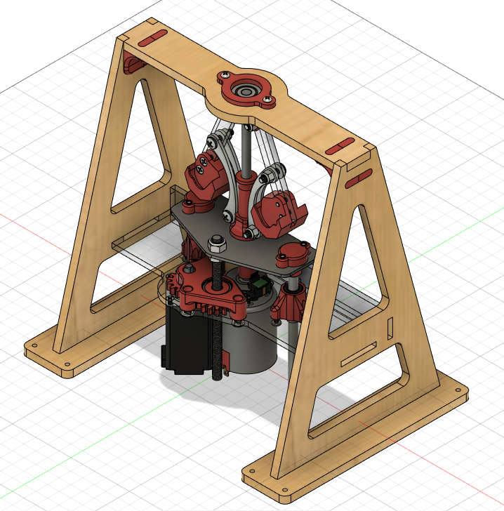
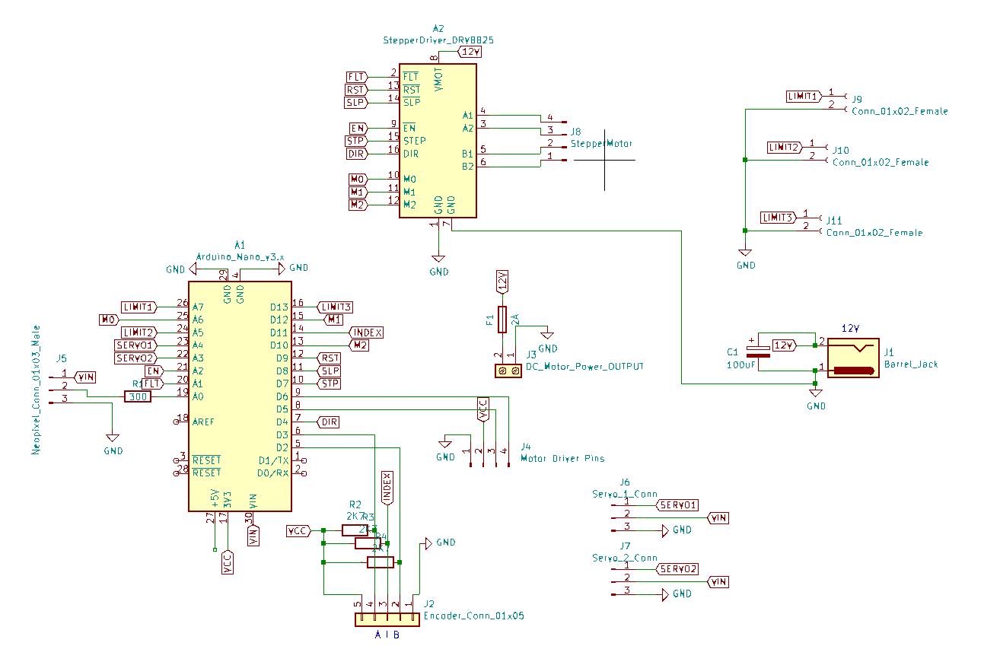

# governor-nidec
Governer experiment with nidec motor (spoiler alert - contains friction!)

**WARNING**: This repository contains the early development stages of a remote lab that was never put into full production or testing. You are recommended to use the updated version of the Spinning Disk experiment available at [spinner-amax](https://github.com/practable/spinner-amax).

## PCB
The PCB files are for a version of the PCB intended to work for a number of different hardware setups and used for the Spinner experiment [spinner-nidex](https://github.com/practable/spinner-nidec) and therefore does not represent the best design for the Governor alone. There is currently no PCB design for the Governor experiment specifically.

## UI
This version of the UI is an early production version written with Vue 2. The same UI is used for the digger-nidec, governor-nidec and spinner-nidec experiments. In the App.vue file one line of code will need to be changed depending on which experiment you are running:

`remoteLabVersion: 'spinning_disk', // or 'robot_arm' or 'variable_governor'`

The UI was only ever put into production and tested with the Spinner hardware and development was stopped on the others before they were at a deployable stage. This means that there is no guarantee that the Digger or Governor versions of the UI will work. The UI has been fully upgraded Vue 3 and updated in the [spinner-amax](https://github.com/practable/spinner-amax) repository.
